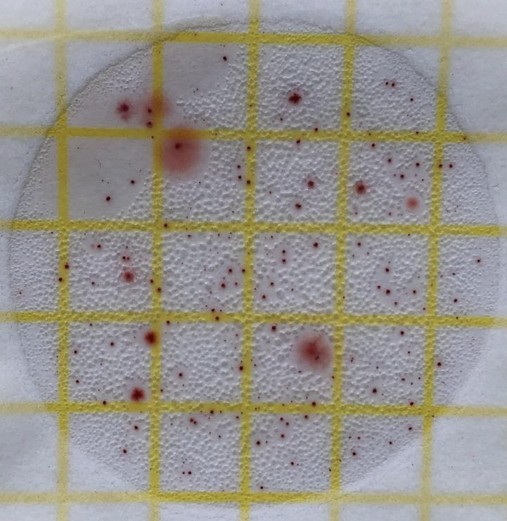
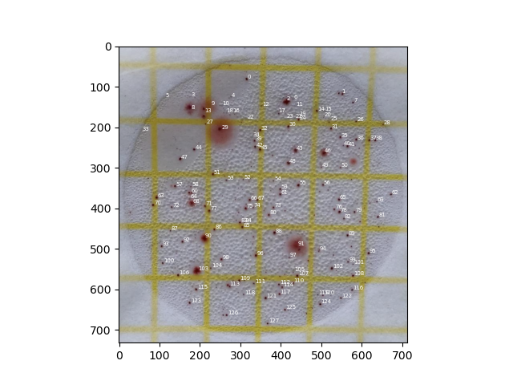

# Colony Counting

## Presentation

In order to **automate the process of manually counting**, this project strives to exploit machine learning algorithms to **count** and **annotate** CFUs (Colony Forming Units) automatically.

The method currently applied is very basic
1. Filter redish pixels (based on a threshold)
2. Apply DBSCAN clustering algorithm to identify the groups of pixels as colonies

**Original**

**Annotated**

## Limits

With the current straightforward method, below is a list of the main limits :

Manual threshold
- The **threshold needs to be set manually** (might be close to 109 for results on pictures similar to the example above).

Incorrect detections
- Mostly due to a too sensitive filter setting, redish points that are **not actual CFUs will be detected as colonies**.
- On the contrary too insensitive filter setting might **miss actual CFUs**.

Lack of generalisation
- The filter is set to take redish points into account. CFUs of a different kind (e.g. greenish) will not be detected.

Lack of text styling
- Changing the style of annotations require to change the code (easy though), there is no graphical interface or a facilitator for design concerns that could help users adapt the style of annotations to match with the image color and contrast.

Lack of interactivity
- There is no current way to add or remove a detected CFU manually by clicking with the mouse, which could be a great enhancement.